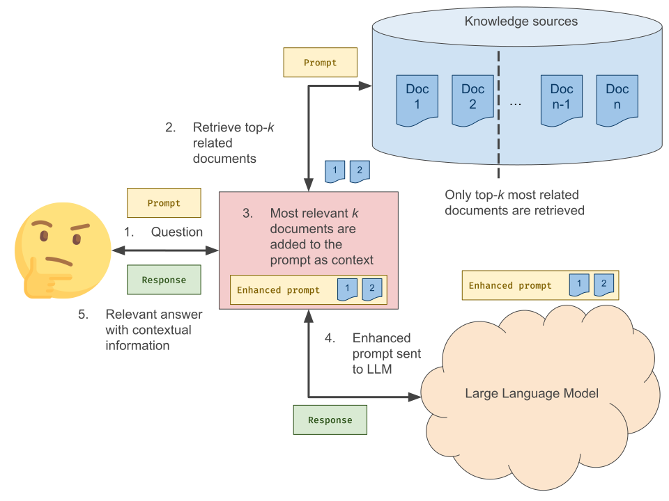
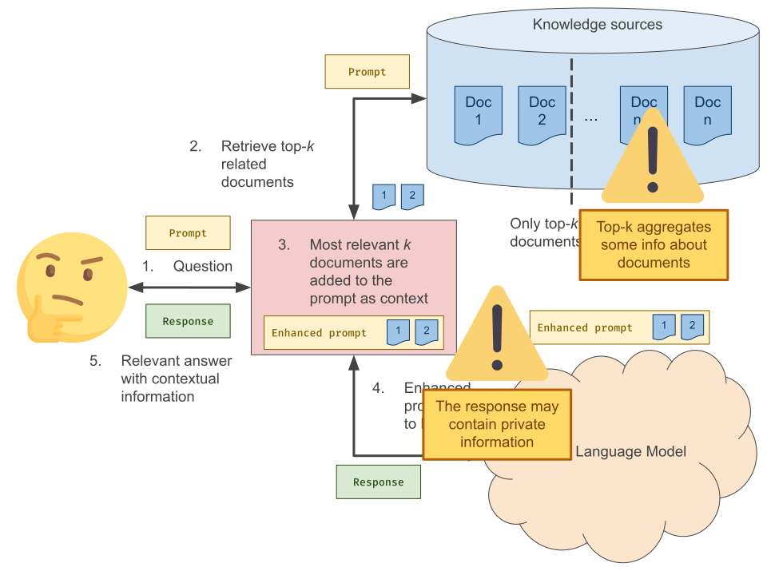
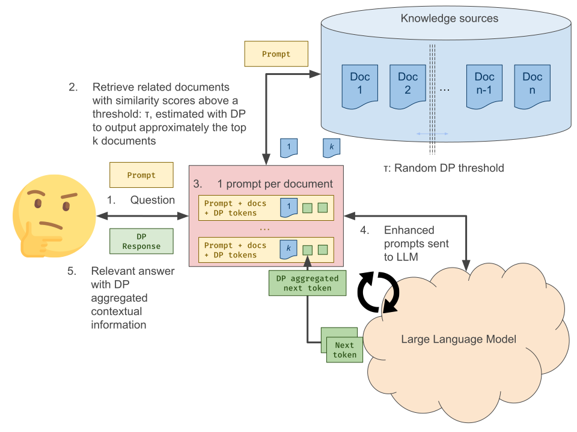
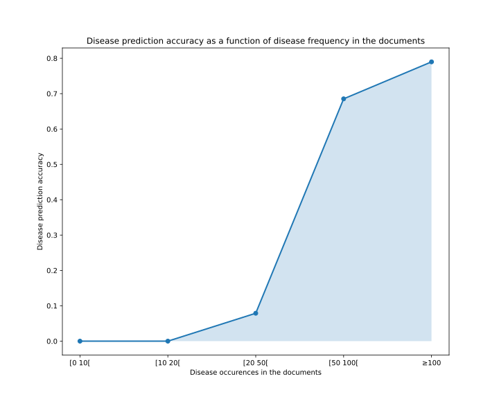

# Introduction

Retrieval-Augmented Generation (RAG, [@lewis2021retrievalaugmentedgenerationknowledgeintensivenlp]) has become a popular approach to enhance the capabilities of Large Language Models (LLMs) by supplying them with up-to-date and pertinent information. This method is particularly valuable in environments where knowledge bases are large and rapidly evolving, such as news websites, social media platforms, or scientific research databases. By integrating fresh context, RAG helps mitigate the risk of "hallucinations"—instances where the model generates plausible but factually incorrect information—and significantly improves the overall quality and relevance of the responses generated by the LLM.

However, incorporating external documents into the generation process introduces substantial privacy concerns. When these documents are included in the input prompt for the LLM, there is no foolproof way to ensure that the generated response will not accidentally reveal sensitive or confidential data [@qi2024followinstructionspillbeans]. This potential for inadvertent data exposure can lead to serious breaches of privacy and presents significant ethical challenges. For instance, if an LLM is used in a healthcare setting and it accidentally includes patient information from an external document in its response, it could violate patient confidentiality and legal regulations.

This paper describes a practical solution (DP-RAG) aimed at addressing these privacy concerns with *Differential Privacy* (DP). The solution is based on two pillars:

* A method to collect documents related to the question in a way that does not prevent its output to be used in a DP mechanism.
* A method to use the collected documents to prompt a LLM and produce a reponse with DP guarantees.

The paper describes also some empirical tests and shows that *DP-RAG* is most effective in context where enough documents give elements of response.

# Related Work

In general there are two families of approaches to add new knowledge to an LLM. The first is *Fine Tunning* (FT) and the other is *Retrieval Augmented Generation* (RAG).
In both these approaches, adding privacy can be done, through simple heuristics with human validation such as *masking* or using a systematic and principle-based approach such as *Differential Privacy*.

## Private Fine-Tuning

A straightforward approach to adding knowledge to an existing LLM is to continue its training with the new knowledge or to Fine Tune (FT) it. However, this raises challenges when dealing with private data, as LLMs tend to memorize training data.
(see [@shokri2017] or [@carlini2021]).

To mitigate this privacy risk, it is possible to redact sensitive content prior to the FT process (aka. *masking*), but this operation is not very reliable and requires judgment on what should be redacted. This is a difficult manual operation based on the perceived sensitivity of each field and how it can be used to re-identify an individual, especially when combined with other publicly available data. Overall, it is very easy to get wrong; leaning too much on the side of prudence can yield useless data, while trying to optimize utility may result in leaking sensitive information.

A solution to this problem is to leverage *Differential Privacy*, a theoretical framework enabling the computation of aggregates with formal privacy garantees (See [@dwork2014algorithmic]).

The most common approache to Private LLM FT is to use Differentially-Private-Stochastic-Gradient-Descent (DP-SGD, see [@Abadi_2016] and [@Ponomareva_2023]). DP-SGD is about clipping gradients and adding them some noise while running your ordinary SGD (or standard variants such as *Adam*, etc.). This method requires the data to be organized per *privacy unit* (typically a privacy unit will be a user). Every training example should belong to one and only one privacy unit[^1].

[^1]: Note that observations (examples) can be grouped into composite observations if one user contributes to many observations.

But, when new documents are frequently added to the private knowledge base FT may not be the best approach.

## Private RAG

When FT is not the best approach to adding new knowledge and RAG would be preferred, DP-FT cannot help with privacy. In these cases, DP can still be levereaged in different ways.
A straightforward approach to DP RAG is to generate synthetic documents with differential privacy out of the private knowledge base and then retrieve documents from this synthetic knowledge base instead of the private one.
Another approach is to generate the LLM response in a DP way.

The approach of generating synthetic documents usable for RAG in privacy-sensitive contexts has been explored by [@zeng2024mitigatingprivacyissuesretrievalaugmented] but without DP garantees.
There are three main approaches to the problem of generating DP Synthetic Data (SD):

* Fine-Tuning a pretrained generative model with DP to generate synthetic documents.
* Use some form of automated prompt tuning to generate synthetic prompts or context documents.
* And use DP aggregated generation.

Fine-Tuning a pretrained generative model with DP can be done with DP-SGD ([@Abadi_2016] and [@Ponomareva_2023]) as mentionned above. An application to synthetic text generation is described there: [@yue2023synthetictextgenerationdifferential]. This method is technically complex, as, DP-SGD can be challenging to implement efficiently [@bu2023differentially].

In [@hong2024dpoptmakelargelanguage], the authors use an automated prompt tuning technique developped in [@sordoni2023jointpromptoptimizationstacked] and [@zhou2023largelanguagemodelshumanlevel] and make it differentially private. From the evaluations presented, it seems to compare favorably to DP-FT synthetic data approaches. Similar methods, based on DP-automated prompt tuning are exposed in [@lin2024differentiallyprivatesyntheticdata] for images and [@xie2024differentiallyprivatesyntheticdata] for text.

A last approach to generating synthetic data is based on DP aggregation of data.[@lebensold2024dprdmadaptingdiffusionmodels] or [@wu2023privacypreservingincontextlearninglarge] show how to aggregate images or text in their embedding space (aka. Embedding Space Aggregation).
Aggregating data privately is also the approach of [@tang2024privacypreservingincontextlearningdifferentially], but they do it at the token level.

This last method greatly inspired the approach described in this document, though not for SD, but to directly generate RAG output from private documents.

# DP-RAG

To overcome the limitations of DP FT or SD-based RAG, we developped and tested DP-RAG: a novel approach, build upon recent works on DP In-Context Learning (ICL) such as [@wu2023privacypreservingincontextlearninglarge] and particularily [@tang2024privacypreservingincontextlearningdifferentially].

- Contrary to [@wu2023privacypreservingincontextlearninglarge], we aggregate outputs token by token.
- Our token aggregation method is different from both methods exposed in: [@tang2024privacypreservingincontextlearningdifferentially] (*Gaussian* and *Report Noisy Max*).
- Because we implement the full RAG system, we developped a method to collect the *top-k* most similar documents in a way that does not jeopardize the possibility to run a DP mechanism on them.

## Overview of DP-RAG

DP-RAG is made of two main components:

* A method to collect documents related to the question in a way that does not prevent its output to be used in a DP mechanism.
* A method to use the collected documents to prompt a LLM and produce a reponse with DP guarantees.

To understand the need for these components, let's describe what RAG is usually made of (see also [@lewis2021retrievalaugmentedgenerationknowledgeintensivenlp]) and introduce some notations (see @Fig:rag).

A LLM: $\mathcal{L}$ is a function, taking some text, in the form of a sequence of tokens: $x = \left<x_1, x_2, \ldots, x_n\right>$ as input and outputing a probability distribution of the next token $x_{n+1}$ conditional on $x$:
$$\mathcal{L}(s, x) = \mathcal{L}(s, \left<x_1, x_2, \ldots, x_n\right>) = \Pr(x_{n+1} = s | \mathcal{L}, x_1, x_2, \ldots, x_n)$$

We assume we have a set of $N$ documents: $D = \left\{d_1, d_2, \ldots, d_N\right\} \subset \mathcal{D}$ containing domain specific knowledge. These documents are also sequences of tokens: $d_i = \left<d_{i,1}, d_{i,2}, \ldots, d_{i,l_i}\right>$. We will, for simplicity, denote $\left<d_i, d_j\right>$ the concatenation of two sequences of token, or a sequence and one token.

We also assume we have a similarity function $S: \mathcal{D}^2 \mapsto [-1, 1]$ which value is close to 1 when two documents are very similar, close to 0 when independent, and close to -1 when conveying opposite meaning. In this work $S$ will be the cosine similarity between some embedings of the documents, mapping them to some adequate $d$-dimensional vector space: $\mathbb{R}^d$:
$$S(d_i, d_j) = \frac{\left<E(d_i), E(d_j)\right>}{\|E(d_i)\|_2\|E(d_j)\|_2}$$

When receiving a query in the form of a sequence of token: $q = \left<q_1, q_2, \ldots, q_{n_q}\right>$, the similarity between $q$ and each document is computed and the top $k$ documents in term of similarity are collected:
$$d_{i_1}, d_{i_2}, \ldots d_{i_k} \text{ with } S(q, d_{i_1}) \geq S(q, d_{i_2}) \geq \ldots \geq S(q, d_{i_N})$$

Then a new query $q_{RAG}$ is built by concatenating the original query $q$ with the top $k$ documents and other elements (the operation is denoted $\left<\cdot, \ldots ,\cdot\right>_{RAG}$)
$$q_{RAG} = \left<q, d_{i_1}, d_{i_2}, \ldots d_{i_k}\right>_{RAG}$$

The augmented query is then sent to the LLM to compute the distribution of the next token (the first token of the response) 
$$\mathcal{L}\left(r_1, \left<q, d_{i_1}, d_{i_2}, \ldots d_{i_k}\right>_{RAG}\right)$$

The token is generated by sampling according to the distribution[^3] or by selecting the mode of the distribution[^4].

[^3]: or proportionaly to some power $1/T$ of the distribution
[^4]: the most likely token or the limit when $T$ goes to $0$

The tokens of the response are then generated one by one in an auto-regressive manner. The generated response tokens are concatenated to the input sequence:
$$\mathcal{L}\left(r_{i+1}, \left<\left<q, d_{i_1}, d_{i_2}, \ldots d_{i_k}\right>_{RAG}, r_1, r_2,\ldots, r_i\right>\right)$$

{ width=100mm #fig:rag }

In the private variant of the problem (DP-RAG), we also assume the documents are *privacy sensitive*, and make the additional assumption that each document relates to only one individual that we call *privacy unit* (PU)[^5].

[^5]: Such structuration of documents by privacy unit can sometime be achieved by cutting documents and groupping all the content relative to one PU in one document.

## Differential Privacy and its application to RAG

A (randomized) algorithm: $\mathcal {A}$ provides $(\epsilon,\delta)$-Differential Privacy *if and only if* for all event $S$ and neighboring datasets $D_0$ and $D_1$, we have:
$$\Pr[{\mathcal {A}}(D_{0})\in S]\leq e^{\varepsilon }\Pr[{\mathcal {A}}(D_{1})\in S]+\delta$$

This means that for datasets that differ by one individual (i.e. neighboring datasets) the algorithm's outputs are indistinguishable. This property guarantees that no bit of information can reasonably be learned about an individual. See [@dwork2014algorithmic] for a thorough introduction to DP.

{ width=100mm #fig:ragpriv }

There are two main challenges to implementoing RAG with DP guarantees. One is to aggregate and randomize the documents to the given question, the other is more subtle, in consists in selecting the most relevant documents without jeopardizing our ability to apply a DP mechanism down the road.

{ width=100mm #fig:dprag }

## Privacy Unit Preserving Document Retrieval

## Differentially Private In-Context Learning

[@durfee2019practicaldifferentiallyprivatetopk] could be used for token selection

{ #fig:accuracy }

# Evaluation

# Conclusion

