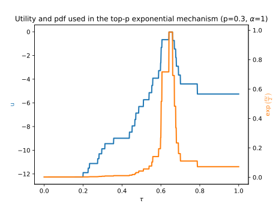

# Introduction

Retrieval-Augmented Generation (RAG, [@lewis2021retrievalaugmentedgenerationknowledgeintensivenlp]) has become a popular approach to enhance the capabilities of Large Language Models (LLMs) by supplying them with up-to-date and pertinent information. This method is particularly valuable in environments where knowledge bases are large and rapidly evolving, such as news websites, social media platforms, or scientific research databases. By integrating fresh context, RAG helps mitigate the risk of "hallucinations"—instances where the model generates plausible but factually incorrect information—and significantly improves the overall quality and relevance of the responses generated by the LLM.

However, incorporating external documents into the generation process introduces substantial privacy concerns. When these documents are included in the input prompt for the LLM, there is no foolproof way to ensure that the generated response will not accidentally reveal sensitive or confidential data [@qi2024followinstructionspillbeans]. This potential for inadvertent data exposure can lead to serious breaches of privacy and presents significant ethical challenges. For instance, if an LLM is used in a healthcare setting and it accidentally includes patient information from an external document in its response, it could violate patient confidentiality and legal regulations.

This paper describes a practical solution (DP-RAG) aimed at addressing these privacy concerns with *Differential Privacy* (DP). The solution is based on two pillars:

* A method to collect documents related to the question in a way that does not prevent its output to be used in a DP mechanism.
* A method to use the collected documents to prompt a LLM and produce a response with DP guarantees.

The paper describes also some empirical tests and shows that *DP-RAG* is most effective in context where enough documents give elements of response.

# Related Work

In general there are two families of approaches to add new knowledge to an LLM. The first is *Fine Tunning* (FT) and the other is *Retrieval Augmented Generation* (RAG).
In both these approaches, adding privacy can be done, through simple heuristics with human validation such as *masking* or using a systematic and principle-based approach such as *Differential Privacy*.

## Private Fine-Tuning

A straightforward approach to adding knowledge to an existing LLM is to continue its training with the new knowledge, to Fine Tune (FT) it. However, this raises challenges when dealing with private data, as LLMs tend to memorize training data.
(see [@shokri2017] or [@carlini2021]).

To mitigate this privacy risk, it is possible to redact sensitive content prior to the FT process (aka. *masking*), but this operation is not very reliable and requires judgment on what should be redacted. This is a difficult manual operation based on the perceived sensitivity of each field and how it can be used to re-identify an individual, especially when combined with other publicly available data. Overall, it is very easy to get wrong; leaning too much on the side of prudence can yield useless data, while trying to optimize utility may result in leaking sensitive information.

A solution to this problem is to leverage *Differential Privacy*, a theoretical framework enabling the computation of aggregates with formal privacy garantees (See [@dwork2014algorithmic]).

The most common approache to Private LLM FT is to use Differentially-Private-Stochastic-Gradient-Descent (DP-SGD, see [@Abadi_2016] and [@Ponomareva_2023]). DP-SGD is about clipping gradients and adding them some noise while running your ordinary SGD (or standard variants such as *Adam*, etc.). This method requires the data to be organized per *privacy unit* (typically a privacy unit will be a user). Every training example should belong to one and only one privacy unit[^1].

[^1]: Note that observations (examples) can be grouped into composite observations if one user contributes to many observations.

But, when new documents are frequently added to the private knowledge base FT may not be the best approach.

## Private RAG

When FT is not the best approach to adding new knowledge and RAG would be preferred, DP-FT cannot help with privacy. In these cases, DP can still be leveraged in different ways.
A straightforward approach to DP RAG is to generate synthetic documents with differential privacy out of the private knowledge base and then retrieve documents from this synthetic knowledge base instead of the private one.
Another approach is to generate the LLM response in a DP way.

The approach of generating synthetic documents usable for RAG in privacy-sensitive contexts has been explored by [@zeng2024mitigatingprivacyissuesretrievalaugmented] but without DP guarantees.
There are three main approaches to the problem of generating DP Synthetic Data (SD):

* Fine-Tuning a pre-trained generative model with DP to generate synthetic documents.
* Use some form of automated prompt tuning to generate synthetic prompts or context documents.
* And use DP aggregated generation.

Fine-Tuning a pre-trained generative model with DP can be done with DP-SGD ([@Abadi_2016] and [@Ponomareva_2023]) as mentioned above. An application to synthetic text generation is described there: [@yue2023synthetictextgenerationdifferential]. This method is technically complex, as, DP-SGD can be challenging to implement efficiently [@bu2023differentially].

In [@hong2024dpoptmakelargelanguage], the authors use an automated prompt tuning technique developed in [@sordoni2023jointpromptoptimizationstacked] and [@zhou2023largelanguagemodelshumanlevel] and make it differentially private. From the evaluations presented, it seems to compare favorably to DP-FT synthetic data approaches. Similar methods, based on DP-automated prompt tuning are exposed in [@lin2024differentiallyprivatesyntheticdata] for images and [@xie2024differentiallyprivatesyntheticdata] for text.

A last approach to generating synthetic data is based on DP aggregation of data.[@lebensold2024dprdmadaptingdiffusionmodels] or [@wu2023privacypreservingincontextlearninglarge] show how to aggregate images or text in their embedding space (aka. Embedding Space Aggregation).
Aggregating data privately is also the approach of [@tang2024privacypreservingincontextlearningdifferentially], but they do it at the token level.

This last method greatly inspired the approach described in this document, though not for SD, but to directly generate RAG output from private documents.

# DP-RAG

To overcome the limitations of DP FT or SD-based RAG, we developed and tested DP-RAG: a novel approach, build upon recent works on DP In-Context Learning (ICL) such as [@wu2023privacypreservingincontextlearninglarge] and particularly [@tang2024privacypreservingincontextlearningdifferentially].

- Contrary to [@wu2023privacypreservingincontextlearninglarge], we aggregate outputs token by token.
- Our token aggregation method is different from both methods exposed in: [@tang2024privacypreservingincontextlearningdifferentially] (*Gaussian* and *Report Noisy Max*).
- Because we implement the full RAG system, we developed a method to collect the *top-k* most similar documents in a way that does not jeopardize the possibility to run a DP mechanism on them.

## Overview of DP-RAG

DP-RAG is made of two main components:

* A method to collect documents related to the question in a way that does not prevent its output to be used in a DP mechanism.
* A method to use the collected documents to prompt a LLM and produce a response with DP guarantees.

To understand the need for these components, let's describe what RAG is usually made of (see also [@lewis2021retrievalaugmentedgenerationknowledgeintensivenlp]) and introduce some notations (see @Fig:rag).

A LLM: $\mathcal{L}$ is a function, taking some text, in the form of a sequence of tokens: $x = \left<x_1, x_2, \ldots, x_n\right>$ as input and outputting a probability distribution of the next token $x_{n+1}$ conditional on $x$:
$$\mathcal{L}(s, x) = \mathcal{L}(s, \left<x_1, x_2, \ldots, x_n\right>) = \Pr(x_{n+1} = s | \mathcal{L}, x_1, x_2, \ldots, x_n)$$

We assume we have a set of $N$ documents: $D = \left\{d_1, d_2, \ldots, d_N\right\} \subset \mathcal{D}$ containing domain specific knowledge. These documents are also sequences of tokens: $d_i = \left<d_{i,1}, d_{i,2}, \ldots, d_{i,l_i}\right>$. We will, for simplicity, denote $\left<d_i, d_j\right>$ the concatenation of two sequences of token, or a sequence and one token.

We also assume we have a similarity function $S: \mathcal{D}^2 \mapsto [-1, 1]$ which value is close to 1 when two documents are very similar, close to 0 when independent, and close to -1 when conveying opposite meaning. In this work $S$ will be the *cosine similarity* between some embeddings of the documents, mapping them to some adequate $d$-dimensional vector space: $\mathbb{R}^d$:
$$S(d_i, d_j) = \frac{\left<E(d_i), E(d_j)\right>}{\|E(d_i)\|_2\|E(d_j)\|_2}$$

When receiving a query in the form of a sequence of token: $q = \left<q_1, q_2, \ldots, q_{n_q}\right>$, the similarity between $q$ and each document is computed and the top $k$ documents in term of similarity are collected:
$$d_{i_1}, d_{i_2}, \ldots d_{i_k} \text{ with } S(q, d_{i_1}) \geq S(q, d_{i_2}) \geq \ldots \geq S(q, d_{i_N})$$

Then a new query $q_{RAG}$ is built by concatenating the original query $q$ with the top $k$ documents and other elements (the operation is denoted $\left<\cdot, \ldots ,\cdot\right>_{RAG}$)
$$q_{RAG} = \left<q, d_{i_1}, d_{i_2}, \ldots d_{i_k}\right>_{RAG}$$

The augmented query is then sent to the LLM to compute the distribution of the next token (the first token of the response) 
$$\mathcal{L}\left(r_1, \left<q, d_{i_1}, d_{i_2}, \ldots d_{i_k}\right>_{RAG}\right)$$

The token is generated by sampling according to the distribution[^3] or by selecting the mode of the distribution[^4].

[^3]: or proportionally to some power $1/T$ of the distribution
[^4]: the most likely token or the limit when $T$ goes to $0$

The tokens of the response are then generated one by one in an auto-regressive manner. The generated response tokens are concatenated to the input sequence:
$$\mathcal{L}\left(r_{j+1}, \left<\left<q, d_{i_1}, d_{i_2}, \ldots d_{i_k}\right>_{RAG}, r_1, r_2,\ldots, r_j\right>\right)$$

{ width=100mm #fig:rag }

In the private variant of the problem (DP-RAG), we also assume the documents are *privacy sensitive*, and make the additional assumption that each document relates to only one individual that we call *privacy unit* (PU)[^5].

[^5]: Such structuring of documents by privacy unit can sometime be achieved by cutting documents and grouping all the content relative to one PU in one document.

## Differential Privacy and its application to RAG

A (randomized) algorithm: $\mathcal {A}$ provides $(\epsilon,\delta)$-Differential Privacy *if and only if* for all event $S$ and neighboring datasets $D_0$ and $D_1$, we have:
$$\Pr[{\mathcal {A}}(D_{0})\in S]\leq e^{\varepsilon }\Pr[{\mathcal {A}}(D_{1})\in S]+\delta$$

This means that for datasets that differ by one individual (i.e. neighboring datasets) the algorithm's outputs are statistically indistinguishable. This property guarantees that no bit of information can reasonably be learned about an individual. See [@dwork2014algorithmic] for a thorough introduction to DP.

{ width=100mm #fig:ragpriv }

The two main challenges to implementing RAG with DP guarantees (see @Fig:ragpriv) consist in:

- aggregating the knowledge from many documents with DP,
- and, more subtly, selecting the most relevant documents without jeopardizing our ability to apply a DP mechanism downstream.

{ width=100mm #fig:dprag }

## Privacy Unit Preserving Document Retrieval

As mentioned above, DP deals with the concept of *neighboring* datasets. For this reason, it is convenient to assign each document to one and only one individual, or *privacy unity* (PU). Adding or removing one PU, comes down to adding or removing one document. In this context, one should be careful with the selection of the top-k most relevant documents. Indeed, when selecting the top-k documents, adding or removing one document may affect the selection of other documents.

In DP-RAG, the similarity of each document with the query is computed:
$$s_1, s_2,\ldots, s_N = S(q, d_1), S(q, d_2), \ldots, S(q, d_N)$$

To estimate a threshold to select the top k documents with DP, we designed a utility function to be plugged into an exponential mechanism [@dwork2014algorithmic] (see @Fig:topkexp).
$$U_{top-k}(\tau): [0, 1] \mapsto \mathbb{R} = -\left|\sum_i\mathbb{1}_{[0, s_i]}(\tau)-k\right|$$

{ width=100mm #fig:topkexp }

This *top-k* utility has sensitivity 1, we can sample a threshold $\tau_{DP}$ from the probability density function:
$$\tau_{top-k}\propto\exp\left(\frac{\epsilon U_{top-k}(\tau)}{2}\right)$$

It is easy to show $\tau_{top-k}$ is $\epsilon$-DP (see. [@dwork2014algorithmic]).

The DP top-k threshold $\tau_{top-k}$ sampled from the exponential mechanism is then used to select all the documents whose similarity is above $\tau_{top-k}$.

While this threshold, works well in practice, it selects a fixed number of documents (~k).
We may be interested in selecting fewer when the top scores are more concentrated on few documents (the query is *selective*), and select more when the scores are evenly spread across many documents (the query has a low *selectivity*).
To adjust to this need, we designed a slightly different utility function:
$$U_{top-p}(\tau): [0, 1] \mapsto \mathbb{R} = -\left|\sum_i\mathbb{1}_{[0, s_i]}(\tau)w(s_i)-p\sum_i w(s_i)\right|$$
with:
$$w(s) = \exp\left(\alpha\frac{s-s_{\max}}{s_{\max}-s_{\min}}\right) \in [0, 1] \text{ when } \alpha>0$$
and similarly:
$$\tau_{top-p}\propto\exp\left(\frac{\epsilon U_{top-p}(\tau)}{2}\right)$$

This utility function (see @Fig:toppexp) is parametrized by $\alpha$ which contrasts the differences in scores, and $p$ which select the share of *total document weight* we want to select with the mechanism.

{ width=100mm #fig:toppexp }

Once the $\tau_{top-p}$ threshold is sampled with DP, incurring a small *privacy loss*, it is safe to select the documents, the similarity scores of which, are above it. They are then *aggregated* with DP in the DP ICL phase.

## Differentially Private In-Context Learning

In DP ICL, instead of sampling the next token from a query enhanced with many documents:
$$L_{j+1}(\cdot) = \mathcal{L}\left(\cdot, \left<\left<q, d_{i_1}, d_{i_2}, \ldots d_{i_k}\right>_{RAG}, r_1, r_2,\ldots, r_j\right>\right)$$

we compute the distributions of the next token for many enhanced queries, each of them with just one document:
$$\left\{\begin{matrix}
L_{j+1,i_1}(\cdot) &=& \mathcal{L}\left(\cdot, \left<\left<q, d_{i_1}\right>_{RAG}, r_1, r_2,\ldots, r_j\right>\right)\\
L_{j+1,i_2}(\cdot) &=&\mathcal{L}\left(\cdot, \left<\left<q, d_{i_2}\right>_{RAG}, r_1, r_2,\ldots, r_j\right>\right)\\
\vdots\\
L_{j+1,i_k}(\cdot) &=&\mathcal{L}\left(\cdot, \left<\left<q, d_{i_k}\right>_{RAG}, r_1, r_2,\ldots, r_j\right>\right)
\end{matrix}\right.$$

We also compute the distribution of the next token, with some public context:
$$L_{j+1, \text{pub}}(\cdot) = \mathcal{L}\left(\cdot, \left<\left<q, d_\text{pub}\right>_{RAG}, r_1, r_2,\ldots, r_j\right>\right)$$

Following [@tang2024privacypreservingincontextlearningdifferentially], we sample a next token based on a DP aggregation of the $k+1$ distributions. 

Contrary to [@tang2024privacypreservingincontextlearningdifferentially] where they compare two mechanisms: *Gaussian* and *Report Noisy Max*, and use a public prior with *Reduce Vocab Publicly* (RVP) we introduce a different mechanism:

- We use an exponential mechanism with a utility aggregating transformed log-probability vectors from all the enhanced queries.
- We do not use Reduce Vocab Publicly (RVP), but a soft version, consisting in using the log-probabilities of a public response to boost or mute some tokens in a soft way.

We sample the next token from an exponential mechanism where the utility is the aggregation of some function: $l^\text{clipped}$ modulated by the log-probabilities associated with the public query. The larger, the $\theta$, the closer the response will be to the one without the private documents. This replaces RVP from [@tang2024privacypreservingincontextlearningdifferentially].
$$U_{ICL}(r) = \theta \cdot \ln\left(L_{j+1, \text{pub}}(r)\right) + \sum_j l_{j+1,i_{j}}^\text{clipped}\left(r\right)$$

In the previous expression $l^\text{clipped}$ is a clipped version of $l^\text{centered}$. $l^\text{centered}$ is clipped to bound its sensitivity ($\infty$-norm) in the exponential mechanism to some $C$.
$$l_{j+1,i_{j}}^\text{clipped}\left(r\right) = l_{j+1,i_{j}}^\text{centered}\left(r\right)\min\left(1, \frac{C}{\max_s \left|l_{j+1,i_{j}}^\text{centered}\left(s\right)\right|}\right)$$

Where $l^\text{centered}$ is a centered version of $l^\text{norm}$ to minimize its $\infty$-norm without changing its impact in the mechanism:
$$l_{j+1,i_{j}}^\text{centered}\left(r\right) = l_{j+1,i_{j}}^\text{norm}\left(r\right)-\frac{\max_sl_{j+1,i_{j}}^\text{norm}\left(s\right)+\min_sl_{j+1,i_{j}}^\text{norm}\left(s\right)}{2}$$

Where $l^\text{norm}$ is a transformation of $L$ putting more emphasis on the large values of $L$.
$$l_{j+1,i_{j}}^\text{norm}\left(r\right) = \frac{\exp\left[\alpha\cdot \left(\ln L_{j+1,i_{j}}\left(r\right) - \ln \max_s L_{j+1,i_{j}}\left(s\right)\right)\right]-1}{\alpha}$$

Indeed, for $\alpha=1$ we simply compute a scaled and shifted version of the probability:
$$l_{j+1,i_{j}}^\text{norm}\left(r\right) = \frac{L_{j+1,i_{j}}\left(r\right)}{\max_s L_{j+1,i_{j}}\left(s\right)}-1$$
for $\alpha$ very small, we compute the log-probabilities:
$$l_{j+1,i_{j}}^\text{norm}\left(r\right) \approx \ln L_{j+1,i_{j}}\left(r\right) - \ln \max_s L_{j+1,i_{j}}\left(s\right)$$
and for $\alpha$ very large, we get an indicator function:
$$l_{j+1,i_{j}}^\text{norm}\left(r\right) \approx 0 \text{ if } r=\text{argmax}_s L_{j+1,i_{j}}\left(s\right) \text{ and } -1 \text{ elsewhere}$$

After the utility is computed, the next token is sampled from:
$$r\propto \exp{\left(\frac{\epsilon U_{ICL}(r)}{2 C}\right)}$$
In this formula, the larger the $\epsilon$ (privacy loss), or the smaller the clipping $C$ the closer we are to the most likely token.

The small (pure) privacy losses incurred during the retrieval phase and the ICL phase are aggregated in a simple privacy accountant: [github.com/google/differential-privacy/tree/main/python/dp_accounting](https://github.com/google/differential-privacy/tree/main/python/dp_accounting).

The code of DP-RAG is available on [github.com/sarus-tech/dp-rag](https://github.com/sarus-tech/dp-rag).

# Evaluation

The DP-RAG algorithm, was tested on synthetic documents available on Huggingface [huggingface.co/datasets/sarus-tech/medical_dirichlet_phi3](https://huggingface.co/datasets/sarus-tech/medical_dirichlet_phi3). The main benefit of using synthetic data is to make sure the LLM used does not *know* anything about the data a priori.

Here are a few examples documents (check the link above for more examples):

| Patient Question | Doctor Response |
|----------------- | --------------- |
| I am Herman Schneider, and I'm grappling with a range of health issues. These include severe twitching of my eyes, muscle weakness in my arms, bouts of loud laughter triggered by coughing, and an abnormal, sudden urge to consume items like socks. | Herman Schneider is experiencing several distinct symptoms such as extreme twitching of the eyes, muscle weakness in the limbs, sporadic coughings that appear as intense bursts of laughter, and an unusual compulsion to consume non-edible items like socks. The medical professionals have pinpointed these symptoms as indicative of a condition known as **Flumplenaxism**. To effectively address and manage these manifestations, the recommended course of action is administering **Gleeblorazine** Injectibles. |
|||
| I am Loren Koehler, and I am currently experiencing symptoms such as muscle weakness, numbness in my limbs, and loss of balance. | Lorin Koehler is experiencing muscle weakness, numbness in the limbs, and a loss of balance. Based on these symptoms, and considering that **Zorbilaxis** is the diagnosed condition, the prescribed treatment would be **Zorblasteron5**. |
|||
| Ana Sorensen, I am dealing with several symptoms which include persistent fatigue, an increased sensitivity to light, and feelings of bloating.| Ana Sorensen, presenting with symptoms such as Fatigue, Increased Sensitivity to Light, and Bloating, has been diagnosed with a condition termed **Snurfluxias**. To address and manage this condition, the recommended course of action is to administer treatments known as **Snurflozone Bites**. |

When a query: $q$, is submitted to DP-RAG, it is used in the Privacy Unit Preserving Document Retrieval process, the retrieved documents are fed into the DP-ICL phase of the algorithm.
Here are a few examples of interactions with the DP-RAG engine.

| Question ($q$) | DP-RAG Response ($\epsilon \approx 5$) |
|----------------- | --------------- |
| I am experiencing the following symptoms: Severe eye twitching, Muscle weakness in the arms, Coughing fits of loud laughter, Sudden urge to eat socks. What is my disease? | Based on the symptoms you've described, it seems you may be experiencing a condition similar to **Flumplenaxism**, as mentioned in the document. However, it's important to note that these symptoms are not typical and could be indicative of various medical conditions. |
|||
| I am experiencing the following symptoms: Muscle weakness, Numbness in limbs, Loss of balance. What is my disease? | Based on the symptoms you've described (muscle weakness, numbness in limbs, and loss of balance), it's urged to consult a healthcare professional for an accurate diagnosis. The document you provided mentions a condition called **Zorbilaxis**, which is treated with **Zorblasteron5**. |
|||
| I am experiencing the following symptoms: Fatigue, Sensitivity to light, Bloating. What is my disease? | Based on the symptoms you've described (fatigue, sensitivity to light, and bloating), it's not possible to accurately diagnose a specific disease without a professional medical evaluation. However, in the context you provided, it seems like the condition might be referred to as **"Snurfluxias"**. |

Because DP-RAG protects privacy by making sure a result does *not* depend on one PU, it will, by design, censor every knowledge that is too specific about one individual. To apprehend this idea, we tested systematically[^6] the accuracy of responses, as a function of disease frequency in the documents (see @Fig:accuracy).

[^6]: See [github.com/sarus-tech/dp-rag/blob/main/results/evaluation.json](https://github.com/sarus-tech/dp-rag/blob/main/results/evaluation.json)

With around 5000 documents and privacy parameters set to $\epsilon \approx 5$, and, $\delta=1e-3$, we got the result in @Fig:accuracy.

{ #fig:accuracy }

The results show the accuracy becomes reasonable when at least 100 documents hold a similar piece of information.

# Conclusion

Overall DP-RAG, provides a viable approach to private RAG in contexts where documents are organized by individual (e.g. Electronic Health Records financial statements) and where sufficiently many documents cover the question asked so that no one individual has an impact on the response.

To improve the *accuracy / privacy tradeoff*, one can:

- Ask question with shorter responses (and limit the number of tokens generated).
- Make sure many documents are related to the question.
- Increase the impact of the public prior ($\theta$) if some elements of the response are public.
